## 制作思路
### 前置知识点

- es5数组新方法学习
  - find
  - filter
- `var task = taskAry.find(item=>item._id == id);`这一行代码如何理解
- 事件委托

### 模板说明

- editing类名的作用
- completed 类名的作用

### 执行npm_install安装项目依赖

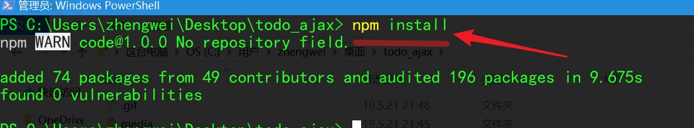

### 打开compass,导入todo.json数据库

```
mongoimport -d todo -c tasks --file ./todo.json
```

### 开启项目

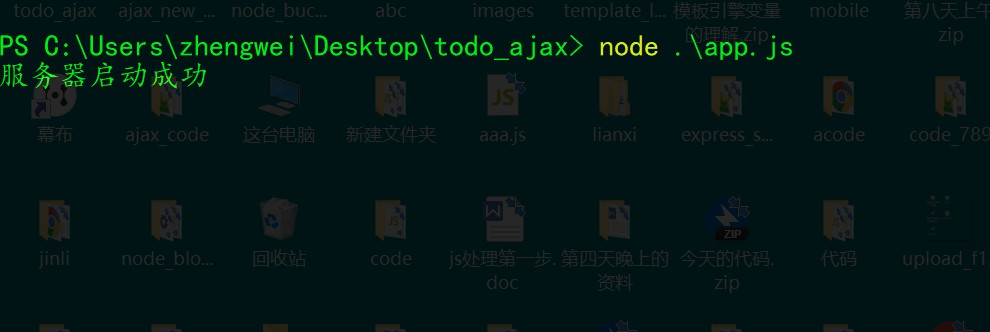

### 实现任务列表展示功能

> 这块代码写得有点繁琐可能同学不太理解，干嘛不写简单一点，视频中是考虑到了接下来的添加这块的，如果大家不太理解，可以写简单一点，到了下一步，可以提取一些变量到公共的，当然也可以不管的

#### 接口

- 请求地址
  - /todo/task 
- 请求方式
  - get 

#### 思路

- 准备一个放置任务列表的数组

- 向服务器端发送请求，获取已存在的任务

- 将已存在的任务存储在任务列表数组中

  ```js
  //用于存放任务列表的数组
  var taskAry = [];
  //向服务器发请求，获取已经存在的任务
  $.ajax({
      url:'/todo/task',
      type:'get',
      success:function(response){
          console.log(response);
          //将已存在的任务存储在taskAry中
          taskAry = response;
      }
  })
  ```

  

- 通过模板引擎将任务列表数组中的任务显示在页面中

  - 给类名为todo-list 的ul添加id名为todo-list 
  - 创建模板
  - 把数据渲染好之后，放到todo-list中

  ```html
  <script src="/js/jquery.min.js"></script>
  <script src="/js/template-web.js"></script>
  <script type="text/html" id="taskTpl">
  <li>
  	<div class="view">
  		<input class="toggle" type="checkbox">
  		<label>{{$value.title}}</label>
  		<button class="destroy"></button>
  	</div>
  	<input class="edit" value="Rule the web">
  </li>
  </script>
  ```

  ```js
  <script>
      //用于存放任务列表的数组
      var taskAry = [];
  //选择任务列表容器
  + var taskBox = $('#todo-list');
  //向服务器发请求，获取已经存在的任务
  $.ajax({
      url:'/todo/task',
      type:'get',
      success:function(response){
          console.log(response);
          //将已存在的任务存储在taskAry中
          taskAry = response;
  +        var html = template('taskTpl',{tasks:taskAry});
  +        taskBox.html(html);
      }
  })
  </script>
  ```

  

### 实现任务添加功能

#### 接口

- 请求地址
  - /todo/addTask 
- 请求方式
  - post
- 请求类型
  - application/json

#### 第一步

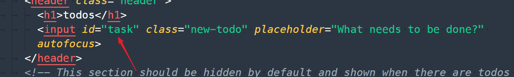

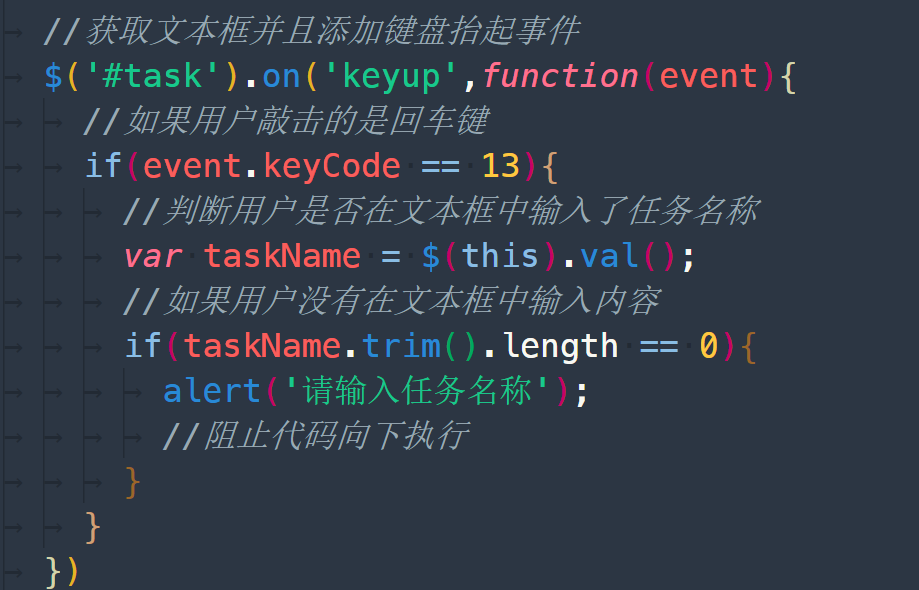

#### 第二步

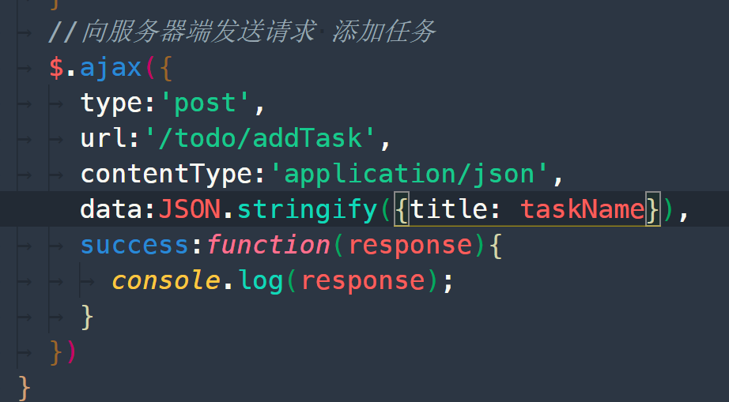

#### 第三步

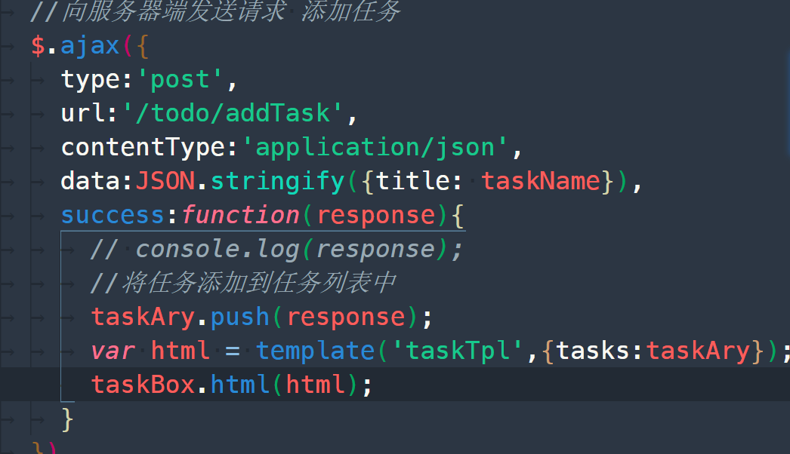

#### 第四步  清空文本框的内容

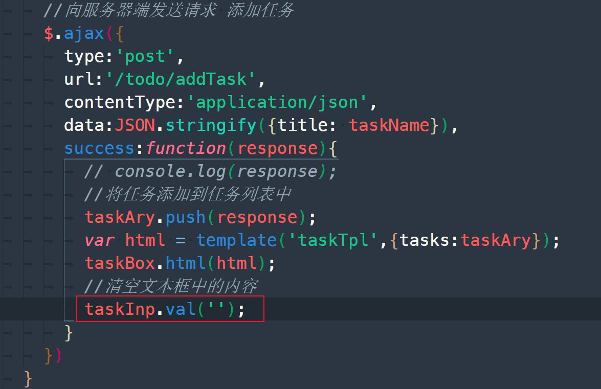

#### 第五步 封装渲染代码

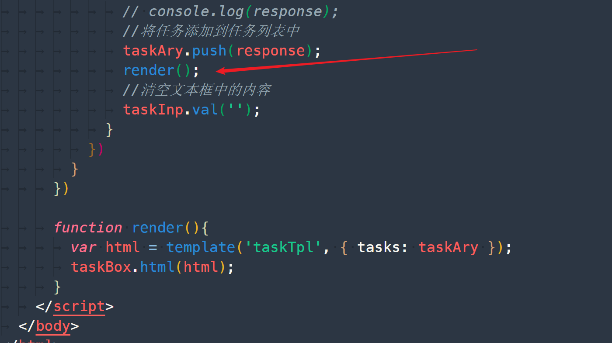


### 实现任务删除功能

#### 接口

- 请求地址
  - /todo/deleteTask 
- 请求方式
  - get
- 参数
  - `_id` 要修改的任务的_id字段

这块用到了事件委托

#### 思路

- 为删除按钮添加点击事件
- 在事件处理函数中获取到要删任务的id
- 向服务器端发送请求，根据id删除任务，同时将任务数 组中的相同任务删除
- 通过模板引擎将任务列表数组中的任务重新显示在页面中


#### 第一步

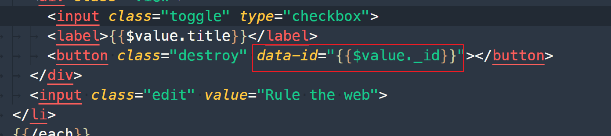

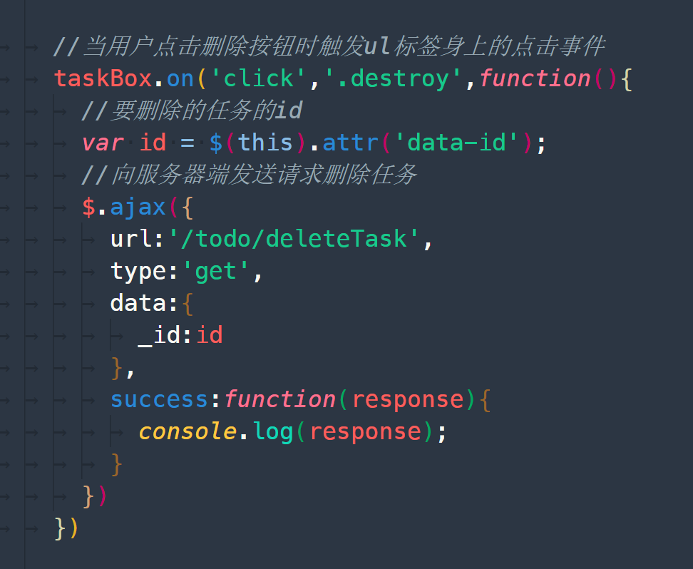

#### 第二步

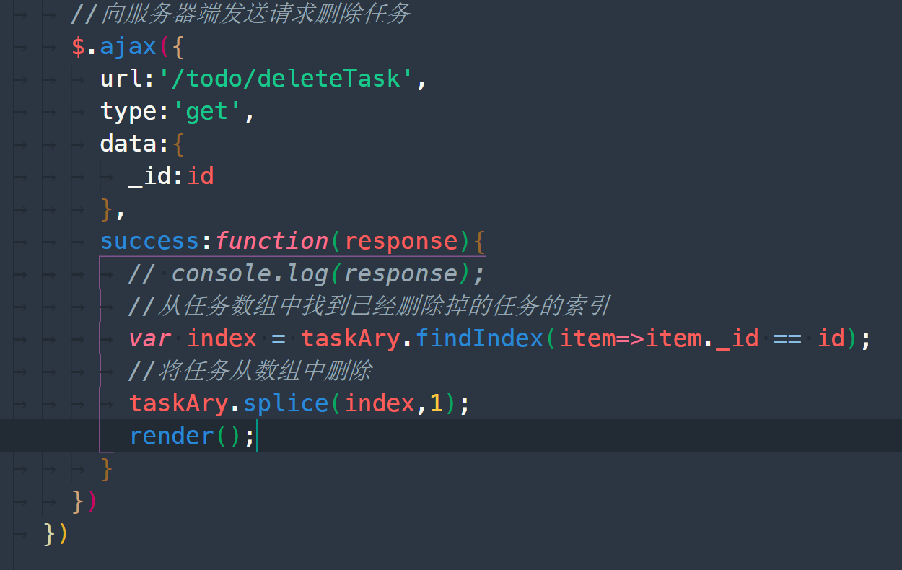


### 修改任务名称

#### 接口

- 请求地址
  - /todo/modifyTask
- 请求方式
  - post
- 参数
  - `_id` 要修改的任务的_id字段
  - title 任务名称
  - completed 任务状态 true 完成 false 未完成
- 请求数据类型
  - application/json

#### 思路

- 为任务复选框添加onchange事件
- 在事件处理函数中获取复选框是否选中
- 向服务器端发送请求，将当前复选框的是否选中状态提交到服务器端
- 将任务状态同时也更新到任务列表数组中
- 通过模板引擎将任务列表数组中的任务重新显示在页面中并且根据任务是否完成为li添加completed类名


```html
<input class="toggle" type="checkbox" {{$value.completed?'checked':''}}>
						<label>{{$value.title}}</label>
```


```js
//当用户改变任务名称前面的复选框状态时触发
taskBox.on('change','.toggle',function(){
    const status = $(this).is(':checked');
    // console.log(status);
    const id = $(this).siblings('button').attr('data-id');
    // console.log(id);

    $.ajax({
        type:'post',
        url:'/todo/modifyTask',
        data:JSON.stringify({_id:id,completed:status}),
        contentType:'application/json',
        success:function(response){
            // console.log(response);
            //将任务状态同步到任务数组中
            var task = taskAry.find(item=>item._id == id);
            //更改任务状态
            task.completed = response.completed;
            //将数组中任务的最新状态更新到页面中
            render();
        }
    })
})
```


### 修改任务名称

#### 接口

- 请求地址
  - /todo/modifyTask
- 请求方式
  - post
- 参数
  - `_id` 要修改的任务的_id字段
  - title 任务名称 可选
  - completed 任务状态 true 完成 false 未完成 可选
- 请求数据类型
  - application/json

#### 思路

- 为任务名称外层的label标签添加双击事件，同时为当前任务外层的li标签添加editing类名，开启编辑状态
- 将任务名称显示在文本框中并让文本框获取焦点
- 当文本框离开焦点时，将用户在文本框中输入的值提交到服务器端，并且将最新的任务名称更新到任务列表数组中
- 使用模板引擎重新渲染页面中的任务列表


```js
//修改任务名称
taskBox.on('dblclick','label',function(){
    //让任务处于编辑状态
    $(this).parent().parent().addClass('editing');
    //将任务名称显示在文本框中
    $(this).parent().siblings('input').val($(this).text());
    //让文本框获取焦点
    $(this).parent().siblings('input').focus();
})

//当文本框离开焦点的时候
taskBox.on('blur','.edit',function(){
    //最新的任务名称
    var newTaskName = $(this).val();
    //编辑任务的id
    var id = $(this).siblings().find('button').attr('data-id');
    //向服务器端发送请求 修改任务名称
    $.ajax({
        url:'/todo/modifyTask',
        type:'post',
        data:JSON.stringify({_id:id,title:newTaskName}),
        contentType:'application/json',
        success:function(response){
            // console.log(response);
            //将当期任务的最新状态同步到任务数组中
            var task = taskAry.find(item=>item._id == id);
            //修改任务名称
            task.title = response.title;
            //将任务数组中的任务同步到页面中
            render();
        }
    })
})
```

### 计算未完成的任务数量

#### 接口

- 请求地址
  - /todo/modifyTask
- 请求方式
  - post
- 参数
  - `_id` 要修改的任务的_id字段
  - title 任务名称 可选
  - completed 任务状态 true 完成 false 未完成 可选
- 请求数据类型
  - application/json

#### 思路

- 准备一个用于存储未完成任务数量的变量
- 将未完成任务从任务数组中过滤出来
- 将过滤结果数组的长度赋值给任务数量变量
- 将结果更新到页面中


```js
// 用于计算未完成任务的数量
function calcCount() {
	// 存储结果的变量
	var count = 0;
	// 将未完成的任务过滤到一个新的数组中
	var newAry = taskAry.filter(item => item.completed == false);
	// 将新数组的长度赋值给count
	count = newAry.length;
	// 将未完成的任务数量显示在页面中
	strong.text(count)
}
```


